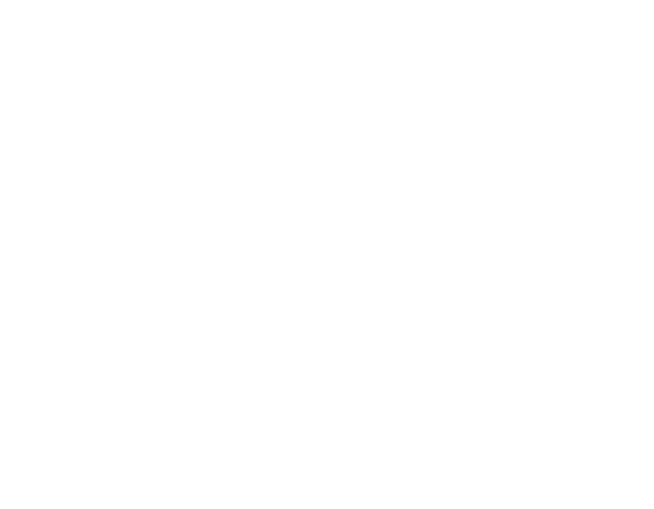

## Test Strategy

---
@title[General Principles]
####General Principles

- All testing is **risk based**
- All testing is **information gathering**
- The cost of fixing a problem is proportional to its age

---

@title[Test Automation principles]
####Test Automation principles

 - Automated testing aims to **confirm that the things we knew to be true, still are**
 - By applying automated testing in our workflow, we aim to **increase release speed** by providing a **safety net** for **confident and rapid change**

---
@title[Test Automation principles]
####Test Automation principles

 - The information given to us by our test automation is **reliable and actionable**
 - Signal
 - Stability > Performance > Coverage

---
@title[Exploratory testing principles]
####Exploratory testing principles

- Exploratory testing aims to tell us **things we don't know**

---

@title[Test pyramid]
####Test pyramid

- The test pyramid isn't something to follow, it's an illustration of the **competing dimensions of isolation and system-confidence**
- Isolation (in the code under test) is **proportional** to execution **determinism** and **speed**
- However, isolation is **inversely proportional** to the **system confidence** provided by the resulting information
    - E.g. 100% decision coverage at UT level won't tell you that a contract has broken, or your ad provider is crashing browsers

---

so..

- (normally) test counts are unit > small integration > large integration > system
- the large integration / system tests that do exist need to provide as much signal as possible

---

Risk

- Exploratory
- Unit
  - Coverage
  - Mutation
- Integration
- System

---

## Web

### Functional

 - Exploratory
 - Integration
 - System

### Non-functional

 - Load
 - Accessibility
 - Security

---

## API

### Functional

 - Exploratory
 - Integration
 - System

### Non-functional

 - Load
 - Security

---

## Contract

---

## Mobile

### Functional

 - Exploratory
 - Integration
 - System

### Non-functional

 - Load
 - Accessibility
 - Security

---

Workflow

- 3 amigos
 - Risks, omissions, contradictions, ambiguities resolved
- Branch active
 - Exploratory prepped, heuristics and sketch plan created
 - Automation prepped, scenarios, behaviours, models, written (and failing - RGR)
- Branch approaching review
 - Exploratory completed (functional, accessibility)
 - Integration automation completed
 - All issues resolved
- PR raised and reviewed
 - Accessibility scan executed
 - Integration tests executed and issues resolved
 - Integration test code reviewed and issues resolved
- Branch merged

---

Bug management

---

Note:
Fast feedback.  The greater the age of a bug, the more impactful and more expensive it is to fix.

All test automation aims to enable ****change with confidence and speed****.  

At a system level, we're primarily aiming to cover ****regression risks**** introduced to the wider system (specifically at the user/consumer interface) by ****changes in its subcomponents****.
---
## Context: Test Pyramid

Note:
The test pyramid is a model often used/abused to describe very different things roughly related to testing.

The most useful way to think of it is to see it as illustrating the ****competing dimensions of isolation and system-confidence****.

Isolation (in the code under test) is ****proportional**** to system (and therefore test) ****determinism**** and the ****speed**** of execution.

However, isolation is ****_inversely_ proportional**** to the ****system confidence**** provided by the resulting information.

Touch on: Vocab: Integration testing in the large/small

Q: How does this relate to API testing?

Q: What’s the difference between system and acceptance testing?

---

Note:
As few as possible _to cover the risks we care about_

Write tests at the ****lowest possible point**** in the pyramid

E.g. Checking a validation message appears is a UI unit test.

Checking that the post-validation transition occurs is likely a system test.

Anti-pattern: _Test all the things!_

Anti-pattern: _Ice cream cone_
---
## When should we write system tests?

Note:
When the interface is stable.

When supporting test strata are in place.

UI churn is common early in development and should be taken into account when considering when to write tests.

---

Note:

High coverage but poor performance results in tests that aren't ran as they take too long.

High performance but poor stability results in tests that aren't ran as they're too expensive to extract information from.

In a nutshell: It's better to have one stable and performant test, than many tests that are slow and / or unstable.

Anti-pattern: Maximising test counts/coverage, e.g. in migration projects.

---
## Design pattern/s

Basic 3 layer
 - Test specification 
 - User behavior encapsulation
 - System abstraction 

---
## Common pitfalls
  - Degradation
    - Quarantine process
  - Silo’d ownership
    - Documentation and education
  - Over reliance
    - Mature and transparent test approach
  - Over engineering
    - KISS, YAGNI
