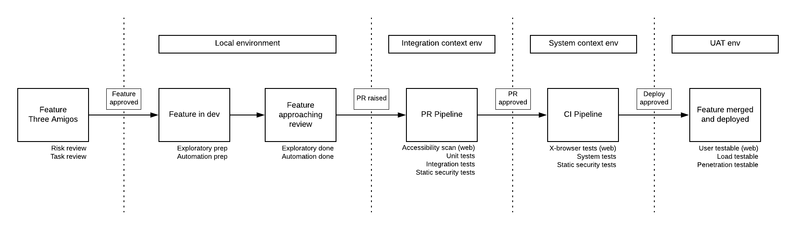

@snap[text-10 text-gold]
Test Strategy
@snapend

---
@title[General Principles]
@snap[north text-uppercase text-10 text-gold span-100]
General Test Principles
@snapend

@snap[west span-100 text-07]
Manually regression checking software is cost prohibitive and doesn't scale
The cost of fixing a problem is proportional to its age
We aim to cover as much risk as we can, as fast as we can

@snapend

Note:
- All testing is **information gathering**
- All worthwhile testing is **risk based**

---

@title[Exploratory testing principles]
@snap[north text-uppercase text-10 text-gold span-100]
Exploratory testing principles
@snapend

@snap[west span-100 text-07]
Tell us **things we don't know**

**Prevent** or **find** costly defects early

**Inform** all other activity (dev, automation, monitoring, etc)
@snapend

---

@title[Test Automation principles]
@snap[north text-uppercase text-10 text-gold span-100]
Test Automation principles
@snapend

@snap[west span-100 text-07]
Confirm that the **things we knew to be true, still are**

**Increase release speed** by providing a safety net for **confident and rapid change**

@snapend
---

@title[Test Automation principles]
@snap[north text-uppercase text-10 text-gold span-100]
Test Automation principles
@snapend

@snap[west span-100 text-07]
Provide information that is **reliable and actionable** (aka *Signal*)

**Stability** > **Performance** > **Coverage**
@snapend

---

@title[Test pyramid]
@snap[north text-uppercase text-10 text-gold span-100]
Test pyramid
@snapend

---

@title[Test pyramid]
@snap[north text-uppercase text-10 text-gold span-100]
Test pyramid
@snapend

@snap[west span-50]

@snapend

@snap[east span-50 text-05]
- The test pyramid isn't something to follow, it's an illustration of the competing dimensions of __isolation__ and __system-confidence__
@snapend

---

@title[Test pyramid]
@snap[north text-uppercase text-10 text-gold span-100]
Test pyramid
@snapend

@snap[west span-50]

@snapend

@snap[east span-50 text-05]
- Isolation (in the code under test) is __proportional__ to execution __determinism__ and __speed__

- However, isolation is __inversely proportional__ to the __system confidence__ provided by the resulting information
@snapend

---

@snap[west span-50]

@snapend

@snap[east span-50 text-05]
So..

- (normally) test counts are unit > small integration > large integration > system
- Where large-integration / system tests that do exist need to provide as much signal as possible
@snapend

---

@snap[north text-uppercase text-10 text-gold span-100]
General test workflow
@snapend

@snap[south span-100 text-05]
Having ephemeral environments for integration and system testing allows us to temporarily retain the environment state for debugging, and prevents state accretion problems.
@snapend

Note:

- 3 amigos
 - Risks, omissions, contradictions, ambiguities resolved
- Feature active
 - Exploratory prepped, heuristics and sketch plan created
 - Automation prepped, scenarios, behaviours, models, written (and failing - RGR)
- Feature approaching review
 - Exploratory completed (functional, accessibility)
 - Integration automation completed
 - All issues resolved
- PR raised and reviewed
 - Accessibility scan executed
 - Integration tests executed and issues actioned
 - Integration test code reviewed and issues actioned
- PR approved
 - Acceptance tests executed and issues actioned
- Feature merged
- Feature deployed to staging
 - Load testing available
 - Security testing available
- Feature deployed to production
 - Live monitoring and alerting active

---

@snap[north text-uppercase text-10 text-gold span-100]
Defect management
@snapend

@snap[west text-07]
Defect reporting is only valuable as a method of clearly conveying information to the team.

The goal is to have the information actioned at the correct time.

Due to context switching, the cost of actioning the information is proportional to it's age.
@snap[west text-07]

Therefore:

For something that is a clear issue, in a live branch, inform the appropriate dev/s.
If the fix is a clear requirement and doesn't significantly affect delivery, implement the fix and confirm resolution.
If the fix is not a clear requirement and/or does significantly affect delivery, the Product Owner chooses to either action an immediate fix, or direct the team to formalise the bug and place it on the backlog for prioritisation.

---

Common questions the strategy should answer

- How many tests to write?
- Is our build too long?
- What happens post release?
- Who is responsible for testing?
- When does testing start?
- What tooling should we use?
- 

---

### Web

#### Functional

 - Exploratory
 - Integration
 - System

#### Non-functional

 - Load
 - Accessibility
 - Security

---

### API

#### Functional

 - Exploratory
 - Integration
 - System

### Non-functional

 - Load
 - Security

---

### Contract

---

### Mobile

#### Functional

 - Exploratory
 - Integration
 - System

#### Non-functional

 - Load
 - Accessibility
 - Security

---

---

---

Pipeline activities

SLAs

---

---

Note:
Fast feedback.  The greater the age of a bug, the more impactful and more expensive it is to fix.

All test automation aims to enable **change with confidence and speed**.  

At a system level, we're primarily aiming to cover **regression risks** introduced to the wider system (specifically at the user/consumer interface) by **changes in its subcomponents**.

Note:
The test pyramid is a model often used/abused to describe very different things roughly related to testing.

The most useful way to think of it is to see it as illustrating the ****competing dimensions of isolation and system-confidence****.

Isolation (in the code under test) is ****proportional**** to system (and therefore test) ****determinism**** and the ****speed**** of execution.

However, isolation is ****_inversely_ proportional**** to the ****system confidence**** provided by the resulting information.

Touch on: Vocab: Integration testing in the large/small

Q: How does this relate to API testing?

Q: What’s the difference between system and acceptance testing?

---

Note:

How many tests to write?

As few as possible _to cover the risks we care about_

Write tests at the ****lowest possible point**** in the pyramid

E.g. Checking a validation message appears is a UI unit test.

Checking that the post-validation transition occurs is likely a system test.

Anti-pattern: _Test all the things!_

Anti-pattern: _Ice cream cone_
---
## When should we write system tests?

Note:
When the interface is stable.

When supporting test strata are in place.

UI churn is common early in development and should be taken into account when considering when to write tests.

---

Note:

High coverage but poor performance results in tests that aren't ran as they take too long.

High performance but poor stability results in tests that aren't ran as they're too expensive to extract information from.

In a nutshell: It's better to have one stable and performant test, than many tests that are slow and / or unstable.

Anti-pattern: Maximising test counts/coverage, e.g. in migration projects.

---
## Design pattern/s

Basic 3 layer
 - Test specification 
 - User behavior encapsulation
 - System abstraction 

---
## Common pitfalls
  - Degradation
    - Quarantine process
  - Silo’d ownership
    - Documentation and education
  - Over reliance
    - Mature and transparent test approach
  - Over engineering
    - KISS, YAGNI
